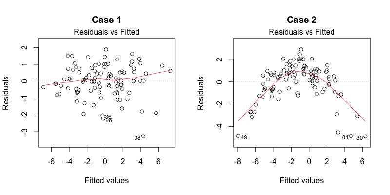
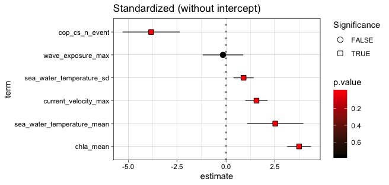

```{r setup, echo = F}
knitr::opts_chunk$set(
  comment = "#",
  collapse = TRUE,
  #cache = TRUE,
  warning = FALSE,
  message = FALSE,
  fig.width=6, fig.height=6,
  fig.align = 'center'
)
```

```{r, include = FALSE}
if (!require(knitr)) install.packages("knitr")
library(knitr)

if (!require(dplyr)) install.packages("dplyr")
library(dplyr)

if (!require(gvlma)) install.packages("gvlma")
library(gvlma)
```

# A brief reminder

.large[
$$Y_{i} = \beta_{0} + \beta_{1} x_{i1} + \cdots + \beta_{p} x_{ip} + \epsilon_{i}$$
]

.pull-left[
- $Y_i$ is the response variable
- $β_0$ is the intercept of the regression line
- $β_p$ is the coefficient of variation for the *nth* explanatory variable
- $x_{ip}$ is the *nth* explanatory variable
- $ε_i$ are the residuals of the model
]

.pull-right[


```{r, echo=FALSE, out.width=450}


```

]

---

# Assumptions


.large[
$$Y_{i} = \beta_{0} + \beta_{1} x_{i1} + \cdots + \beta_{p} x_{ip} + \epsilon_{i}$$
]


.pull-left[

1. The residuals are independent
2. The residuals are normally distributed
3. The residuals have a mean of 0
4. The residuals are homoskedastic (they have constant variance)

]

.pull-right[

```{r, echo=FALSE, out.width=400}


```

]

--

.center[

.comment[These assumptions concern the residuals, not the response or explanatory variables]

]

---

# Multiple linear regression

**Generalization of simple linear regression**

.center[
.large[
$$Y_i = \alpha + \beta_1x_{1i}+\beta_2x_{2i}+\beta_3x_{3i}+...+\beta_kx_{ki} + \epsilon$$
]
]

&nbsp;

- **Response variable** $\Rightarrow$ 1 continuous variable
- **Explanatory variables** $\Rightarrow$ 2 or more continuous variables

&nbsp;

**Assumptions** (.small[*In addition to the usual assumptions of linear models*])
- Linear relationship between each explanatory variable and response variable
- Explanatory variables are orthogonal (.alert[No collinearity])
  - Collinearity produces unstable parameters estimate and large $se$ for the linear terms

---

# Workflow

.small[

1. **Plot the data**
2. **Create the model** $\Rightarrow$ select your variables
    - Hypotheses (which predictors? form of the relationships?)
    - Collinearity among predictors
    - Stepwise regression analysis / Ranking models
3. **Test the model assumptions** 
    - Check the residuals
4. **Adjust the model if assumptions are violated**
    - Transform response variable
    - Use other tools (e.g. Generalised Linear Models)
5. **Interpret the results**
    - $R^2$ and significance
    - Regression parameters and effect size estimates
    - Visualize the model

]

---

# Workflow


```{r, echo=FALSE, out.width=600}

```

&nbsp;

```{r, echo=FALSE, out.width=600}

```


.footnote[Accessible [here](http://onlinelibrary.wiley.com/doi/10.1111/j.2041-210X.2009.00001.x/full) and [here](https://besjournals.onlinelibrary.wiley.com/doi/full/10.1111/2041-210X.12577) (with R code in the supplementary material!)]

---

class: inverse, center, middle

background-image: url("images/r_transition.png")
background-size: cover

---

# The iris dataset

```{r}
# Load the data
data(iris)
```

```{r, echo = FALSE}
kable(head(iris,3), format = "html") 
```

```{r}
summary(iris, digits = 2)
```

---

# 1. Plot the data

.pull-left[

```{r iris-plot, eval=FALSE}
# A glimpse of the data
library(ggplot2)

ggplot(data = iris, 
    mapping = aes(x = Petal.Length, 
                  y = Petal.Width, 
                  color = Species)) + 
  geom_point()
```

```{r, echo=FALSE, out.width=300}


```

]

.pull-right[

&nbsp;

&nbsp;

```{r iris-plot-out, ref.label="iris-plot", echo=FALSE}
```
]

---

# 2. Create the model : collinearity ?

```{r}
# Correlation among the potential predictors of Petal Width
var_cor <- cor(iris[,1:3], method = "pearson", use="pairwise.complete.obs")

var_cor
```

.pull-left[

```{r corplot, eval=FALSE}
# Graphical representation
library(ggcorrplot)

ggcorrplot(var_cor, 
  hc.order = TRUE, 
  type = "upper", 
  lab = FALSE, 
  method="circle", 
  colors = c("tomato2", "white", 
             "springgreen3"))

```
]

.pull-right[
```{r corplot-out, ref.label="corplot", echo=FALSE, out.width = '300px'}
```
]


---

# 2. Create the model : collinearity ?

- **Variance Inflation Factors** (VIF) quantify the extent of correlation between each predictor and the other predictors in the model.

$$VIF = \frac{1}{1-R^2}$$

- Variables with .alert[VIF > 5] are usually considered collinear.

- Can be computed using the `vif()` function of package `car` or using functions from the `usdm` (.small[*Uncertainty Analysis for Species Distribution Models*]) package : `vif()` or `vifcor()` or `vifstep()` and `exclude()`

```{r}
# Collinearity among the potential predictors of Petal Width
usdm::vif(iris[,1:3])
```

---

# 2. Starting simple

```{r, eval = TRUE}
mod <- lm(Petal.Width ~ Petal.Length, data = iris)
```

.pull-left[

&nbsp;

&nbsp;

```{r residuals, eval = FALSE}
# Diagnostic of the residuals
par(mfrow=c(2,2))
plot(mod)
```
]

.pull-right[
```{r, ref.label="residuals", echo=FALSE}
```
]


---

# Residuals vs fitted

This plot shows if residuals have non-linear patterns. If you find equally spread residuals around a horizontal line without distinct patterns, that is a good indication you don’t have non-linear relationships.

&nbsp;

```{r, echo=FALSE, out.width=700}



```

---

# Normal Q-Q

Are residuals normally distributed ? It’s good if residuals are lined well on the straight dashed line.

&nbsp;

```{r, echo=FALSE, out.width=700}

knitr::include_graphics("images/residuals_2.jpg")

```

---

# Scale-Location

Also called Spread-Location plot. This plot shows if residuals are spread equally along the ranges of predictors. This is how you can check the assumption of equal variance (homoscedasticity). It’s good if you see a horizontal line with equally (randomly) spread points.

&nbsp;

```{r, echo=FALSE, out.width=700}

knitr::include_graphics("images/residuals_3.jpg")

```

---

# Residuals vs Leverage

Influential outliers ? We watch out for outlying values at the upper right corner or at the lower right corner. Look for cases outside of a dashed line, Cook’s distance.

```{r, echo=FALSE, out.width=700}

knitr::include_graphics("images/residuals_4.jpg")

```

--

.alert[You should never remove outliers if you don't have good reasons to do so (ex: error of measurement) and if you do so, say it !]

---

# Back to our model

```{r, echo = FALSE, out.width = 500}
par(mfrow=c(2,2))
plot(mod)
```

--

.comment[**NOTE**: The `gvlma()` function from `gvlma` package offers a way to automatically check all the major assumptions of linear models]

---

```{r}
gvlma::gvlma(mod)
```

---

# May be not so bad in that case

.pull-left[

```{r iris-plot-lm, eval=FALSE}
ggplot(data = iris, 
    mapping = aes(x = Petal.Length, 
                  y = Petal.Width)) + 
  geom_point() +
  geom_smooth(method ="lm")
```

```{r, echo = FALSE}
plot(mod, which = 3)
```


]

.pull-right[

&nbsp;

&nbsp;

```{r iris-plot-lm-out, ref.label="iris-plot-lm", echo=FALSE}
```
]

---

# May be not so bad in that case

```{r}
d <- iris
d$predicted <- predict(mod) # Save the predicted values
d$residuals <- residuals(mod) # Save the residual values
```

.pull-left[

```{r iris-plot-lm2, eval=FALSE}
ggplot(data = d, 
   mapping = aes(x = Petal.Length, 
                 y = Petal.Width)) +
 geom_smooth(method = "lm", se = FALSE, 
             color = "lightgrey") + 
 geom_segment(aes(xend = Petal.Length, 
                  yend = predicted), 
              alpha = .2) +
 geom_point(aes(color = abs(residuals), 
              size = abs(residuals))) + 
 scale_color_continuous(low = "blue", 
                        high = "red") +
 guides(color = FALSE, size = FALSE) + 
 geom_point(aes(y = predicted), 
            shape = 1) +
 theme_linedraw()
```

]

.pull-right[

&nbsp;

```{r iris-plot-lm-out2, ref.label="iris-plot-lm2", echo=FALSE}
```
]

---

# 5. Interpretation of the outputs

```{r}
summary(mod)
```


---

# 5. Interpretation of the outputs

.left-column[


**Estimates**

&nbsp;

&nbsp;

&nbsp;

&nbsp;

**Standard Error**

&nbsp;

&nbsp;

**t-value**
]

.right-column[

- For the intercept: expected value when all the features are at 0 $\Rightarrow$ meaning ? (.comment[centering predictors]) 

- For the predictors: expected change in the response due to a unit change in the predictor (.comment[standardizing predictors]) 

&nbsp;

- The standard error of the estimates $\Rightarrow$ allow to construct marginal confidence intervals for the estimates, which is given by $\hat{\beta}_i\pm 2\cdot se(\hat{\beta}_i)$ for the 95% confidence interval

&nbsp;

- $t = \frac{\hat{\beta}_i - 0}{se(\hat{\beta}_i)}$ $\Rightarrow$ tells us about how far our estimated parameter is from a hypothesized 0 value

]

---

# 5. Interpretation of the outputs

```{r}
mod$coef

summary(mod)$coef

confint(mod)

summary(mod)$r.squared

summary(mod)$adj.r.squared
```

---

# 5. Interpretation of the outputs

- **Centering the predictors**

The slopes between the predictors and the response variable doesn’t change but .alert[the interpretation of the intercept does].

--

&nbsp;

.pull-left[
**Before centering**

.small[
Intercept = mean of the response when all predictors == 0
]
]

.pull-right[
**After centering**

.small[
Intercept = mean of the response when all predictors are at their mean
]
]

&nbsp;

.comment[

1. Do we want to interpret the intercept ?

2. Is 0 meaningful ?

2. Is the mean meaningful ? $\Rightarrow$ center on other values ?

]

---

# 5. Interpretation of the outputs

- **Standardizing the predictors**

The coefficients estimated are now standardized slopes, meaning that the units of the regression coefficients are the same 

--

.pull-left[
**Before standardizing**

.small[
Slopes = expected change in the response due to a unit change in the predictor
]
]

.pull-right[
**After standardizing**

.small[
Slopes = expected change in the response due to a change of one **standard deviation** in the predictor
]
]

--

.comment[
.small[

**Standardized** coefficients are comparable within models and between studies $\Rightarrow$ standardized effect size estimates (.alert[but beware of the range covered for of each variable])

**Unstandardized** effect size estimates may be more meaningful in some context because they depend on the phenotypic variation in each study population
]
]

---

# Centered vs standardized predictors

```{r}

# Initial model
mod <- lm(Petal.Width ~ Petal.Length + Sepal.Width, data = iris)

# Model with centered variables
iris_cent <- iris
iris_cent[,c("Petal.Length","Sepal.Width")] <-
  scale(iris_cent[,c("Petal.Length","Sepal.Width")], 
        center = TRUE, scale = FALSE) 

mod_cent <- lm(Petal.Width ~ Petal.Length + Sepal.Width, data = iris_cent)

# Model with standardized variables
iris_stand <- iris
iris_stand[,c("Petal.Length","Sepal.Width")] <-
  scale(iris_stand[,c("Petal.Length","Sepal.Width")], 
        center = TRUE, scale = TRUE) 

mod_stand <- lm(Petal.Width ~ Petal.Length + Sepal.Width, data = iris_stand)

```

---

# Centered vs standardized predictors

```{r echo = TRUE, width = 700}
par(mfrow=c(2,2))
plot(mod)
```

---

# Centered vs standardized predictors

```{r echo = TRUE, width = 700}
par(mfrow=c(2,2))
plot(mod_cent)
```

---

# Centered vs standardized predictors

```{r echo = TRUE, width = 700}
par(mfrow=c(2,2))
plot(mod_stand)
```

---

# Centered vs standardized predictors

```{r}

summary(mod)$coef

summary(mod_cent)$coef

summary(mod_stand)$coef
```


---

# Centered vs standardized predictors

.pull-left[

&nbsp;

```{r, echo=FALSE, out.width=700}

```


]

.pull-right[

&nbsp;

```{r, echo=FALSE, out.width=700}

```


]

.footnote[
See the function `ggcoef()`from the `GGally` package
]

---

# Centered vs standardized predictors

.pull-left[

&nbsp;

```{r, echo=FALSE, out.width=700}

```

&nbsp;

```{r, echo=FALSE, out.width=700}

```
]

.pull-right[

&nbsp;

```{r, echo=FALSE, out.width=700}

```

&nbsp;

```{r, echo=FALSE, out.width=700}

```
]

.footnote[
See the function `ggcoef()`from the `GGally` package
]

---

# Centered vs standardized predictors

&nbsp;

- This applies to Linear Mixed Models (LMM), Generalized Linear Models (GLM) and  Generalized Linear Mixed Models (GLMM)

--

&nbsp;

```{r, echo=FALSE, out.width=800}


```

.footnote[Accessible [here](https://besjournals.onlinelibrary.wiley.com/doi/abs/10.1111/j.2041-210X.2010.00012.x)]


---

class: inverse, center, middle

# Reality is often more complex

## *Interactions, mixed models and random factors*

---

# A more complicated example

.pull-left[

&nbsp;

```{r iris-plot-sepal-1, eval=FALSE}
ggplot(data = iris, 
    mapping = aes(x = Sepal.Length, 
                  y = Sepal.Width, 
                  color = Species)) + 
  geom_point()
```

]

.pull-right[

&nbsp;

&nbsp;

```{r iris-plot-sepal-1-out, ref.label="iris-plot-sepal-1", echo=FALSE}
```
]

---

# A more complicated example

.pull-left[

&nbsp;

```{r iris-plot-sepal-2, eval=FALSE}
ggplot(data = iris, 
    mapping = aes(x = Sepal.Length, 
                  y = Sepal.Width, 
                  color = Species)) + 
  geom_point() +
  geom_smooth(aes(x = Sepal.Length, 
                  y = Sepal.Width), 
              inherit.aes = FALSE, 
              method = "lm", 
              col = "black")
```

]

.pull-right[

&nbsp;

&nbsp;

```{r iris-plot-sepal-2-out, ref.label="iris-plot-sepal-2", echo=FALSE}
```
]

---

# A more complicated example

.pull-left[

&nbsp;

```{r iris-plot-sepal, eval=FALSE}
ggplot(data = iris, 
    mapping = aes(x = Sepal.Length, 
                  y = Sepal.Width, 
                  color = Species)) + 
  geom_point() +
  geom_smooth(aes(fill = Species), 
              method = "lm")
```

]

.pull-right[

&nbsp;

&nbsp;

```{r, ref.label="iris-plot-sepal", echo=FALSE}
```
]

---

# A more complicated example

.pull-left[

&nbsp;

```{r, eval=FALSE}
ggplot(data = iris, 
    mapping = aes(x = Sepal.Length, 
                  y = Sepal.Width, 
                  color = Species)) + 
  geom_point() +
  geom_smooth(aes(fill = Species), 
              method = "lm")
```

&nbsp;

.comment[

$\Rightarrow$ **Need to account for this structure in the data**

]
]

.pull-right[

&nbsp;

&nbsp;

```{r, ref.label="iris-plot-sepal", echo=FALSE}
```
]


---

# Interaction terms

**Interaction** : The effect of one factor depends on the level of the other $\Rightarrow$ the effect of the factor is larger (for a positive coefficient) or smaller (for a negative coefficient) when the other is above its mean.

--

```{r}
lm(Sepal.Width ~ Sepal.Length*Species, data=iris)$coef
```

.small[
1. Intercept 
2. The slope betwen `length` and `width`
3. The difference between the mean of *Setosa* and *Versicolor* when `length` is 0
5. The change in the slope `width~length` between *Setosa* and *Versicolor* species
]

---

```{r}
lm(Sepal.Width ~ Sepal.Length*Species, data=iris)$coef

lm(Sepal.Width ~ Sepal.Length*Species - 1, data=iris)$coef

lm(Sepal.Width ~ Sepal.Length + Species + Sepal.Length:Species - 1, data=iris)$coef
```

---

# Interaction terms

.pull-left[

```{r inter-plot, eval = FALSE}

library(dplyr)

mod <- lm(Sepal.Width ~ 
            Sepal.Length*Species, 
          data=iris)

d <- iris %>%
  mutate(fit = predict(mod))

ggplot(data = d, 
    mapping = aes(x = Sepal.Length, 
                  y = Sepal.Width, 
                  color = Species)) + 
  geom_point() +
  geom_line(aes(y=fit))

```


]

.pull-right[

&nbsp;

```{r, echo = FALSE, ref.label="inter-plot"}
```

]

---

# Plotting marginal effects

.pull-left[
```{r marg-plot1, eval = TRUE}
sjPlot::plot_model(mod, 
                   type = "pred", 
                   terms = "Sepal.Length")
```
]


.pull-right[
```{r marg-plot2, eval = TRUE}
sjPlot::plot_model(mod, 
                   type = "pred", 
                   terms = "Species")
```
]


---

# Interaction terms

```{r}
# Model the species separately
lm(Sepal.Width ~ Sepal.Length, data=iris %>% filter(Species == "versicolor"))$coef
# Model using the interaction term
lm(Sepal.Width ~ Sepal.Length*Species - 1, data=iris)$coef
```

--

**Note**:

.small[

- This changes the residuals (3 instead of 1)

- Advantage of interaction terms when multiple explanatory variables to control which interactions are included

- Harness the power of *contrasts* (more on contrasts [here](https://stats.idre.ucla.edu/r/library/r-library-contrast-coding-systems-for-categorical-variables/), [here](https://rstudio-pubs-static.s3.amazonaws.com/65059_586f394d8eb84f84b1baaf56ffb6b47f.html) and [here](https://bbolker.github.io/mixedmodels-misc/notes/contrasts.pdf))

]

---

# But...

.pull-left[

.small[

.comment[3 linear models (one per species)]

- Estimate 3 intercepts and 3 slopes (and we only have one predictor and species-level variations $\Rightarrow$ sites ?)
  
- Reduced sample sizes $\Rightarrow$ lower power

]
]

.pull-right[

&nbsp;

&nbsp;

```{r, ref.label="iris-plot-sepal", echo=FALSE}
```
]

---

# But...

.pull-left[

.small[

.comment[3 linear models (one per species)]

- Estimate 3 intercepts and 3 slopes (and we only have one predictor and species-level variations $\Rightarrow$ sites ?)
  
- Reduced sample sizes $\Rightarrow$ lower power

.comment[If we lump everything]

- Bigger sample size

- Pseudoreplication ?

- Confounding factors ?

]

]

.pull-right[

&nbsp;

&nbsp;

```{r iris-plot-sepal-out, ref.label="iris-plot-sepal-2", echo=FALSE}
```
]

---

# But...

.pull-left[


.small[

.comment[3 linear models (one per species)]

- Estimate 3 intercepts and 3 slopes (and we only have one predictor and species-level variations $\Rightarrow$ sites ?)
  
- Reduced sample sizes $\Rightarrow$ lower power

.comment[If we lump everything]

- Bigger sample size

- Pseudoreplication ?

- Confounding factors ?

]

]

.pull-right[

&nbsp;

&nbsp;

```{r iris-plot-sepal-out, ref.label="iris-plot-sepal-2", echo=FALSE}
```
]

&nbsp;

.center[

$\Rightarrow$ **Need something to control for this factor**

]

---

# Fixed versus random effect

--

.comment[Previously, we used `species` as a **fixed effect**]

- Fixed: results in the estimation of **6 parameters** (3 intercepts and 3 slopes)

- We wish to make conclusions about the levels of the factor from which the data come from

- Implies that we consider that the data comes from all possible levels of the factor


---

# Fixed versus random effect

.comment[Alternatively, we can use `species` as a **random effect**]

--

- Grouping factor $\Rightarrow$ we want to control for it, but are not really interested in the effect of each individual levels of the factor


--

- The data includes only a random sample of all possible levels of the factor


--

- Intercepts and/or slopes are allowed to vary according to the random factor .comment[but estimate fewer parameters than classical regression]


--

- Intercepts, slopes and their confidence interval are adjusted to take into account the data structure $\Rightarrow$ .comment[uses all the data available while accounting for pseudoreplication and controlling for differences among species]

--

&nbsp;

.center[

**Linear Mixed Models** $\Rightarrow$ balance between separating and lumping

]

---

# Random intercept models

.pull-left[

&nbsp;

- Assume that the intercepts come from a normal distribution 
- Only need to estimate the mean and standard deviation of the normal distribution (instead of 3 intercepts, i.e. one for each species)

]

.pull-right[

&nbsp;

```{r, echo=FALSE, out.width=900}

```

]

&nbsp;

**Note**: The more levels your factor has, the more accurately the mean and standard deviation of the normal distribution will be estimated $^1$

.footnote[
$^1$ Three levels may be a little low, but easier to visualize!
]

---

# Random intercept models

```{r}

library(lme4)

rand_int_mod <- lmer(Sepal.Width ~ Sepal.Length + (1|Species), data = iris)

library(nlme)

rand_int_mod2 <- lme(Sepal.Width ~ Sepal.Length, random = ~1|Species, data = iris)

```

--

.small[
**Note**:

- `lme4` is somehow an extension to `nlme`. 
- `lme4` better handles huge number of random effects (parts coded in *C*)
- `nlme` allows to specify the variance-covariance matrix for the random effects, which you cannot do in `lme4`

$\Rightarrow$ **`nlme` offers a much broader class of covariance structures for the random effects but the flexibility of lme4 is sufficient for most applications**

]

---

# Random intercept models

&nbsp;

.pull-left[

&nbsp;

```{r randmod, eval = FALSE}
d <- iris %>%
  mutate(fit = predict(rand_int_mod))

ggplot(data = d, 
    mapping = aes(x = Sepal.Length, 
                  y = Sepal.Width, 
                  color = Species)) + 
  geom_point() +
  geom_line(aes(y=fit))

```

]

.pull-right[

```{r, echo = FALSE, ref.label="randmod"}

```


]

---

# Random slope models

.pull-left[

&nbsp;

- The same principle applies to **slopes** (just more difficult to visualize)

- As for intercepts, only the mean and standard deviation of the slopes are estimated (instead of 3 distinct slopes)

]

.pull-right[

&nbsp;

```{r, echo=FALSE, out.width=900}

```

]

--

```{r}
# With lme4
rand_slope_mod <- lmer(Sepal.Width ~ Sepal.Length + 
                      (0 + Sepal.Length|Species), 
                      data = iris)
```

---

# Random intercept and slope models

.pull-left[

&nbsp;

- Combining both random slopes and random intercepts

- Estimates 4 parameters

]

.pull-right[

&nbsp;

```{r, echo=FALSE, out.width=900}

```

]

--

```{r}
# With lme4
rand_mod <- lmer(Sepal.Width ~ Sepal.Length + 
                      (1 + Sepal.Length|Species), 
                      data = iris)

# Or
rand_mod <- lmer(Sepal.Width ~ Sepal.Length + 
                      (Sepal.Length|Species), 
                      data = iris)

```


---

class: center

### Summary of random effects

.small[

```{r, echo = FALSE}

tab1 <- tibble(
  "Formula" = 
  c(
    "(1 | g)",
    "0+offset(o)+(1|g)",
    "(1 | g1/g2)",
    "(1 | g1) + (1 | g2)",
    "x + (x | g)",
    "x + (x || g)",
    "x + (0 + x | g)"
    ), 
  "Alternative" =
  c(
    "1+(1|g)",
    "-1+offset(o)+(1|g)",
    "(1 | g1)+(1 | g1:g2)",
    "1 + (1 | g1) + (1 | g2)",
    "1 + x + (1 + x | g)",
    "1 + x + (1 | g) + (0 + x | g)",
    "1 + x + (-1 + x | g)"
  ),
  "Meaning" =
  c(
    "Random intercept with mean and sd to be estimated from the data",
    "Random intercept with a priori means to specify",
    "Nested random effects: intercept varying among g1 and g2 within g1",
    "Intercept varying among g1 and g2",
    "Correlated random intercept and slope",
    "Uncorrelated random intercept and slope",
    "Random slope without random intercept"
  )
  )

kable(tab1, format = "html")   
```

]

---

# LMM take into account data structure

.pull-left[

&nbsp;

If a certain species is poorly represented (low n) in the data, the model will give more weight to the pooled model to estimate the intercept and slope of that species or lake.

]

.pull-right[

&nbsp;

```{r, echo=FALSE, out.width=900}
knitr::include_graphics("images/low_representation.png")
```

]

---

# LMM take into account data structure

.small[
The confidence intervals for the intercepts and slopes are adjusted to take account of the pseudo-replication using intraclass correlation coefficient (ICC)
]

.pull-left[

.small[

- **High ICC**: points from the same species are treated as a single observation because they are very correlated $\Rightarrow$ small effective sample size and large confidence intervals for slope and intercept


- **Low ICC**: treated as independent observations because little correlated $\Rightarrow$ large effective sample size and small confidence intervals for slope and intercept

]
]

.pull-right[

```{r, echo=FALSE, out.width=250}

```

]

---

# Note on estimation methods

&nbsp;

REML (Restricted Maximum Likelihood) is the default method in `lmer`

&nbsp;

**Note**:

- The standard deviation estimator in the Maximum Likelihood (ML) is biased by a factor of $(n-2) / n$. The REML method corrects this bias and gives a correct estimator for the standard deviation $\Rightarrow $ we should compare **nested random effect models with REML**

- REML assumes that the fixed effects structure is correct while ML doesn’t rely on the coefficients of the fixed effect$\Rightarrow$ we should compare **nested fixed effect models with ML **

---

# Model selection

&nbsp;

.large[

1. Build a full "fixed" model

2. Select the best random structure (`REML = TRUE`)

3. Select the fixed terms with the selected random structure (`REML = FALSE`)

4. Report the model with `REML = TRUE`

]

---

# Step 1 & 2: choosing the random structure

```{r}
mod1 <- gls(Sepal.Width ~ Sepal.Length * Petal.Width * Petal.Length, data = iris, 
            method = "REML")

mod2 <- lme(Sepal.Width ~ Sepal.Length * Petal.Width * Petal.Length, 
            random = ~ 1|Species, data = iris, method = "REML")

mod3 <- lme(Sepal.Width ~ Sepal.Length * Petal.Width * Petal.Length, 
            random = ~ Sepal.Length|Species, data = iris, method = "REML")

mod4 <- lme(Sepal.Width ~ Sepal.Length * Petal.Width * Petal.Length, 
            random = ~ Sepal.Length + Petal.Length|Species, data = iris,
            method = "REML")

mod5 <- lme(Sepal.Width ~ Sepal.Length * Petal.Width * Petal.Length, 
            random = list(~Sepal.Length | Species, ~Petal.Length|Species),
            data = iris, method = "REML")
```

Note the use of `gls()`

---

# Step 1 & 2: choosing the random structure

.pull-left[
```{r}
summary(mod4)
```
]

.pull-right[
```{r}
summary(mod5)
```
]

---

# Step 1 & 2: choosing the random structure

```{r}
anova(mod1, mod2, mod3, mod4, mod5)

wiqid::AICtable(MuMIn::AICc(mod1, mod2, mod3, mod4, mod5), digits=3, sort = TRUE)
```

--

.small[

- AICc corrects for bias created by small sample sizes

- Models with $\Delta AIC < 2$ are often considered equally plausible

- To go further: model averaging (see [here](https://esajournals.onlinelibrary.wiley.com/doi/abs/10.1002/ecm.1309) and the function `MuMIn::model.avg()`)

]

---

# Step 3: select the fixed structure

```{r}
mod_sel <- mod2 <- lme(Sepal.Width ~ Sepal.Length * Petal.Width * Petal.Length, 
                       random = ~ 1|Species, data = iris, method = "ML")

mod.step <- MASS::stepAIC(mod_sel)

```

---

# Step 3: select the fixed structure

```{r}
summary(mod.step)
```

---

# Step 4: report the selected model

```{r}
mod.step$call

mod_fin <- lme(fixed = Sepal.Width ~ Sepal.Length + Petal.Width + 
    Petal.Length + Sepal.Length:Petal.Width + Petal.Width:Petal.Length,
    data = iris, random = ~1 | Species, method = "REML")

```

---

# Step 4: report the selected model

```{r}
summary(mod_fin)
```

---

# Check the model

```{r}
plot(mod_fin)
```

---

# $R^2$ of Linear Mixed Models

&nbsp;

**Marginal $R^2$**: proportion of variance explained by the fixed factor(s) alone

**Conditional $R^2$**: proportion of variance explained by both the fixed and random factors

&nbsp;

```{r}
piecewiseSEM::rsquared(mod_fin)
```

.footnote[
- Nakagawa, S., and H. Schielzeth. 2013. A general and simple method for obtaining $R^2$ from generalized linear mixed-effects models. Methods in Ecology and Evolution 4(2): 133-142. DOI: [10.1111/j.2041-210x.2012.00261.x](https://besjournals.onlinelibrary.wiley.com/doi/full/10.1111/j.2041-210x.2012.00261.x)

- Johnson, Paul C.D. 2014. Extension of Nakagawa & Schielzeth’s R2GLMM to random slopes models. Methods in Ecology and Evolution. DOI: [10.1111/2041-210X.12225.](https://besjournals.onlinelibrary.wiley.com/doi/full/10.1111/2041-210X.12225)

]

---

# Random effects models

Used to estimate variance components (see [here](http://essedunet.nsd.uib.no/cms/topics/multilevel/ch3/1.html) for more info) 

```{r}
mod1 <- lme(Sepal.Width ~ 1, random = ~ 1|Species,data = iris)
mod2 <- lme(Sepal.Length ~ 1, random = ~ 1|Species,data = iris)

ape::varcomp(mod1, scale = TRUE)
ape::varcomp(mod2, scale = TRUE)
```

Can be used with nested scales (e.g. [Messier et al. 2010](https://onlinelibrary.wiley.com/doi/10.1111/j.1461-0248.2010.01476.x
))

```{r, eval = FALSE}
model <-  lme(reef_cover ~ 1, random=~1|site_name/quadrat, data=surveys_cleaned)

```

---

class: center, inverse, middle

# Exercises

---

# Scenario 1

* You have inventoried species richness **in 1000 quadrats** that are within **10 different sites** which are also within **10 different forests**.

* You also **measured productivity** in each **quadrat**.

* You want to know if productivity is a good predictor of biodiversity

.alert[What mixed model could you use for this dataset?]

&nbsp;

--

# 

&nbsp;

```{r, eval = F}
lmer(Biodiv ~ Productivity + (1 | Forest / Site))
```

Here the random effects are nested (i.e. Sites within forest) and not crossed

---

# Scenario 2

* You have collected **200 fish** from **12 different sites** evenly distributed across **4 habitat types** that are found within **the same lake**.

* You measured **the length of each fish** and the **amount of mercury in its tissue**.

* You want to know if habitat is a good predictor of mercury concentration and how it influences mercury accumulation

.alert[What mixed model could you use for this dataset?]

&nbsp;

--

# 

&nbsp;

```{r, eval = F}
lmer(Mercury ~ Length * Habitat_Type + (1 | Site))
```

---

# Practice

.center[

## Dataset you are working on ?

or 

## Lake data

Q : Does fish trophic position increase with fish size for all three fish species?

&nbsp;

```{r, echo=FALSE, out.width=600}
knitr::include_graphics("images/lake_data.png")
```

]

---

# Answers

```{r}
data <- read.csv("data/lake_data.csv", header = T)
pairs(data)

ggplot(aes(x= Fish_Length, y=Trophic_Pos, colour = Fish_Species), data = data) +
  geom_point() +
  geom_smooth(method = "lm")

```

---

.small[
```{r}
# Full model with varying intercepts
M1 <- lmer(Trophic_Pos ~ Fish_Length + (1 | Fish_Species) + (1 | Lake), 
           data = data, REML = TRUE)
# Full model with varying intercepts and slopes
M2 <- lmer(Trophic_Pos ~ Fish_Length + (1 + Fish_Length | Fish_Species) + 
           (1 + Fish_Length | Lake),
           data = data, REML = TRUE)
# No Lake, varying intercepts only
M3 <- lmer(Trophic_Pos ~ Fish_Length + (1 | Fish_Species), 
           data = data, REML = TRUE)
# No Species, varying intercepts only
M4 <- lmer(Trophic_Pos ~ Fish_Length + (1 | Lake), 
           data = data, REML = TRUE)
# No Lake, varying intercepts and slopes
M5 <- lmer(Trophic_Pos ~ Fish_Length + (1 + Fish_Length | Fish_Species), 
           data = data, REML = TRUE)
# No Lake, varying slopes
M5.2 <- lmer(Trophic_Pos ~ Fish_Length + (0 + Fish_Length | Fish_Species), 
             data = data, REML = TRUE)
# No Species, varying intercepts and slopes
M6 <- lmer(Trophic_Pos ~ Fish_Length + (1 + Fish_Length | Lake), 
           data = data, REML = TRUE)
# Full model with varying intercepts and slopes only varying by lake
M7 <- lmer(Trophic_Pos ~ Fish_Length + (1 | Fish_Species) + (1 + Fish_Length | Lake),
           data = data, REML = TRUE)
# Full model with varying intercepts and slopes only varying by species
M8 <- lmer(Trophic_Pos ~ Fish_Length + (1 + Fish_Length | Fish_Species) + (1 | Lake),
           data = data, REML = TRUE)
```
]

---

# Comparison of the models

```{r}
wiqid::AICtable(MuMIn::AICc(M1,M2,M3,M4,M5,M6,M7,M8), digits=3, sort = TRUE)
```

---

class: center

## Ressources

&nbsp;

.pull-left[

```{r, echo=FALSE, out.width=300}
knitr::include_graphics("images/book_zuur.jpg")
```

]


.pull-right[

```{r, echo=FALSE, out.width=500}

```

]

---

```{r session_info, out.width = "50%"}

sessionInfo()

```
