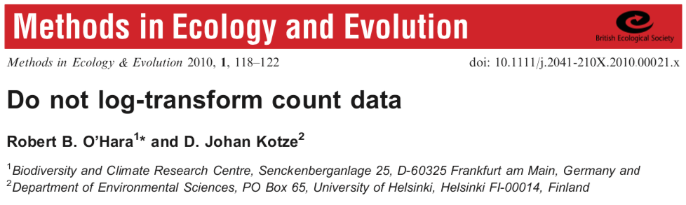
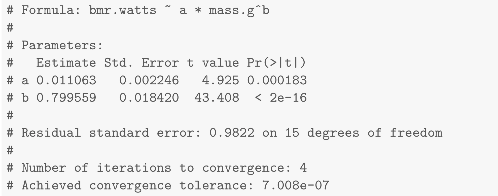
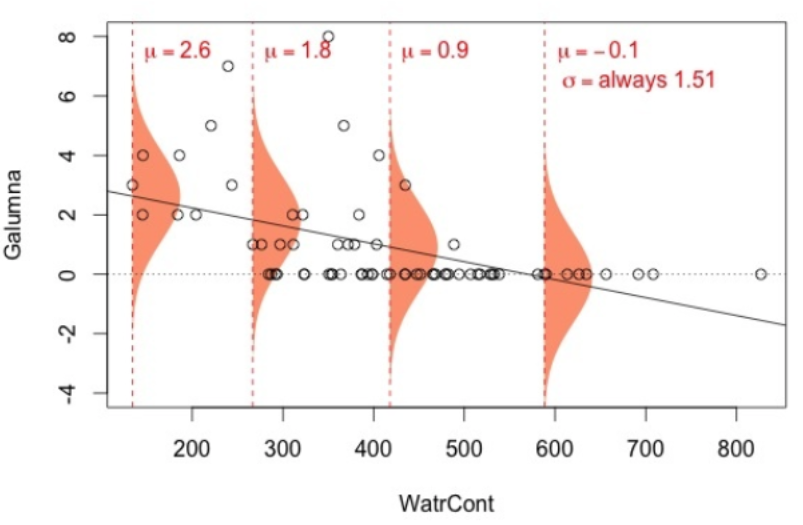
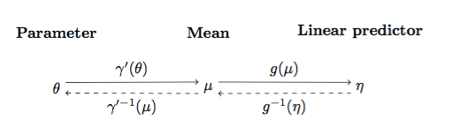

```{r setup, echo = F}
knitr::opts_chunk$set(
  comment = "#",
  collapse = TRUE,
  #cache = TRUE,
  warning = FALSE,
  message = FALSE,
  fig.width=6, fig.height=6,
  fig.align = 'center'
)

mypar = list(mar = c(3,3,1,0.5), mgp = c(1.6, 0.3, 0), tck = -.02)
```

```{r, include = FALSE}
if (!require(knitr)) install.packages("knitr")
library(knitr)

if (!require(kableExtra)) install.packages("kableExtra")
library(kableExtra)
```

# Assumptions of Linear Models

1. **Linearity**
2. **Residuals**:
  - Independent
  - Equal variance
  - Normally distributed

--

.large[
**But life is not always linear so what to do ?**
]

--

1. If nonlinear terms are additive fit with OLS (polynomial regressions)
2. Transform? But think about what it will do to error 
3. Nonlinear Least Squares 
4. Generalized Linear Models & Mixed Models (GLM/GLMM)

---

# Assumptions of Linear Models

1. **Linearity**
2. **Residuals**:
  - Independent
  - Equal variance
  - Normally distributed

.large[
**But life is not always linear so what to do ?**
]

1. .comment[**If nonlinear terms are additive fit with OLS (polynomial regressions)**]
2. Transform? But think about what it will do to error 
3. Nonlinear Least Squares 
4. Generalized Linear Models & Mixed Models (GLM/GLMM)

---

# Polynomial regressions

&nbsp;

.large[
$$Y_{i} = \beta_{0} + \beta_{1} x_{i} + \beta_{2} x_{i}^2 + \cdots + \epsilon_{i}$$
]

&nbsp;

```{r echo=FALSE, warning=FALSE}
poly.reg=data.frame(Degree = 0:5,
                    Name = c("Constant","Linear","Quadratic",
                             "Cubic","Quartic","Quintic"),
                    Example = c("\\(3\\)",
                                "\\(x+9\\)",
                                "\\(x^2-x+4\\)",
                                "\\(x^3-x^2+5\\)",
                                "\\(6x^4-x^3+x-2\\)",
                                "\\(x^5-3x^3+x^2+8\\)"))
knitr::kable(poly.reg, format = "html", escape=FALSE)
```


---

# Polynomial regressions

&nbsp;

```{r, eval = FALSE}
poly_reg <- lm(y ~ x + I(xˆ2) + I(xˆ3), data=data)
# or
poly_reg <- lm(y ~ poly(x, degree = 3), data=data)
````

&nbsp;

- However, note that `x`, `I(xˆ2)`, `I(xˆ3)` will be correlated if they are not centered variables ([Schielzeth, 2010](https://besjournals.onlinelibrary.wiley.com/doi/10.1111/j.2041-210X.2010.00012.x)), which can cause problems. 

- The use of `poly()` avoid this by producing orthogonal polynomials.

- In general, if a higher order term is included (e.g. a quadratic term), the lower order terms (e.g. the intercept and linear terms) must also be in the model. This is known as the “principle of marginality”.

---

# Polynomial regressions

&nbsp;

.center[

```{r, eval = TRUE, echo = FALSE, out.height = 500}
tmp <- rnorm(50)

tmp <- poly(tmp, degree = 3)

par(mfrow=c(2,1))
plot(tmp[,1], tmp[,2], xlab = "Polynome 1", ylab = "Polynome 2", main = "Output of poly()")
plot(tmp[,1], tmp[,3], xlab = "Polynome 1", ylab = "Polynome 3")
```

]

---

# Assumptions of Linear Models

1. **Linearity**
2. **Residuals**:
  - Independent
  - Equal variance
  - Normally distributed

.large[
**But life is not always linear so what to do ?**
]

1. If nonlinear terms are additive fit with OLS (polynomial regressions)
2. .comment[**Transform? But think about what it will do to error**]
3. Nonlinear Least Squares 
4. Generalized Linear Models & Mixed Models (GLM/GLMM)

---

# Transformations

```{r, echo=FALSE, out.width=650}

```

.small[

"When the error structure of data is simple, a transformation (usually a log or power-transformation) can be quite useful to improve the ability of a model to fit to the data by stabilizing variances or by making relationships linear before applying simple linear regression"

"However, a transformation is not guaranteed to solve these problems: there may be a trade-off between homoscedasticity and linearity, or the family of transformations used may not be able to correct one or both of these problems"

]

.footnote[
See the article [here](https://besjournals.onlinelibrary.wiley.com/doi/full/10.1111/j.2041-210X.2010.00021.x) and the blog post by Jarrett Byrnes [Do Not Log-Transform Count Data, Bitches!](https://www.r-bloggers.com/do-not-log-transform-count-data-bitches/)
]

---

# Transformations 

**Common transformations**
- log(y)
- log(y) and log(x) (power function)
- arcsin(sqrt(y)) for bounded data
- logit for bounded dat `car::logit()`
- Box-Cox Transform `MASS::boxcox()`

--

**Illustration of the issue with error**
.center[
$log(MetabolicRate) = log(a) + b \times log(mass) + error$ 

implies

$MetabolicRate = a \times mass^b \times e^{error}$ 

but what we often want is

$MetabolicRate = a \times mass^b + error$
]

---

# Assumptions of Linear Models

1. **Linearity**
2. **Residuals**:
  - Independent
  - Equal variance
  - Normally distributed

.large[
**But life is not always linear so what to do ?**
]

1. If nonlinear terms are additive fit with OLS (polynomial regressions)
2. Transform? But think about what it will do to error
3. .comment[**Nonlinear Least Squares**] 
4. Generalized Linear Models & Mixed Models (GLM/GLMM)

---

# Nonlinear Least Squares fitting

```{r, eval = FALSE}
mod <- nls(metab_rate~a*mass^b, data = my_data,
           start = list(a=0.02, b=0.7))
```

```{r, echo=FALSE, out.width=650}

```

- Least square method for fitting
- Very flexible
- .alert[Must specify start values]

---

# Assumptions of Linear Models

1. **Linearity**
2. **Residuals**:
  - Independent
  - Equal variance
  - Normally distributed

.large[
**But life is not always linear so what to do ?**
]

1. If nonlinear terms are additive fit with OLS (polynomial regressions)
2. Transform? But think about what it will do to error
3. Nonlinear Least Squares
4. Generalized Linear Models & Mixed Models (GLM/GLMM)

---

# Assumptions of Linear Models

.alert[

1. **Linearity**
2. **Residuals**:
  - Independent
  - Equal variance
  - Normally distributed

]

.large[
**But life is not always linear so what to do ?**
]

1. If nonlinear terms are additive fit with OLS (polynomial regressions)
2. Transform? But think about what it will do to error
3. Nonlinear Least Squares
4. .alert[Generalized Linear Models & Mixed Models (GLM/GLMM)]

---

# Assumptions on the residuals

```{r,echo=TRUE}
mites <- read.csv('data/mites.csv')
head(mites,3)
```

This dataset is a subset of the 'Oribatid mite dataset'

.small[
> `library(vegan); data(mite)` $\Rightarrow$ 70 moss and mite samples
>
> 5 environmental measurements and abundance of the mite *Galumna sp.*
]

**Goal**: Model the abundance (`abund`), occurrence (`pa`), and proportion (`prop`) of Galumna as a function of the 5 environmental variables.

---

# Assumptions on the residuals

A negative relationship between `Galumna` and water `content`?

```{r,fig.width=12,fig.height=4.5,echo=-1}
  par(mypar)
  par(mfrow = c(1, 3), cex = 1.4)
  plot(Galumna ~ WatrCont, data = mites, xlab = 'Water content', ylab='Abundance')
  boxplot(WatrCont ~ pa, data = mites, xlab='Presence/Absence', ylab = 'Water content')
  plot(prop ~ WatrCont, data = mites, xlab = 'Water content', ylab='Proportion')
```

---

# Assumptions on the residuals

Fit linear models to test whether `abund`, `pa`, and/or `prop` varies as a function of water content.

--
```{r}
lm.abund <- lm(Galumna ~ WatrCont, data = mites)
lm.pa <- lm(pa ~ WatrCont, data = mites)
lm.prop <- lm(prop ~ WatrCont, data = mites)
```

--
.pull-left[
```{r}
# p-values
summary(lm.abund)$coefficients[, 4]
summary(lm.pa)$coefficients[, 4]
summary(lm.prop)$coefficients[, 4]
```
]
.pull-right[
&nbsp;

Significant relationship in all models!

.alert[But...]
]

---

# Assumptions on the residuals

Look at that error for the abundance ! 

.pull-left[
```{r,echo=-1}
par(mypar);par(cex = 1.4)
plot(Galumna ~ WatrCont, data = mites)
abline(lm.abund)
```
]

.pull-right[
```{r,echo=-1}
par(mypar)
par(mfrow = c(2, 2), cex = 1.4)
plot(lm.abund)
```
]

---

# Assumptions on the residuals

It's not better for the proportion `prop`:

.pull-left[
```{r,echo=-1}
par(mypar);par(cex = 1.4)
plot(prop ~ WatrCont, data = mites)
abline(lm.prop)
```
]

.pull-right[
```{r,echo=-1}
par(mypar)
par(mfrow = c(2, 2), cex = 1.4)
plot(lm.prop)
```
]

---

# Assumptions on the residuals

It's getting even worse for presence/absence `pa`:

.pull-left[
```{r,echo=-1}
par(mypar);par(cex = 1.4)
plot(pa ~ WatrCont, data = mites)
abline(lm.pa)
```
]

.pull-right[
```{r,echo=-1}
par(mypar)
par(mfrow = c(2, 2), cex = 1.4)
plot(lm.pa)
```
]

---

class: inverse, center, middle

# Why be normal?

## *Your data is ok;*
## *it's the model that's wrong*

---

# Different ways to write the same model

#### Option 1

.center[

$y_{i} = \beta_{0} + \beta_{1} x_{i} + \epsilon_{i}$

$\epsilon_{i} \sim N(0,\sigma^2)$

]

#### Option 2 

.center[

$y_{i} \sim N(\mu_{i},\sigma^2)$ 

$\mu_{i} = \beta_{0} + \beta_{1} x_{i}$ 

$\epsilon_{i} \sim N(0,\sigma^2)$

]

&nbsp;

This means that $y_i$ is drawn from a normal distribution with parameters $\mu$ (which depends on $x_i$) and $\sigma$ (which has the same value for all $Y$s)

---

# Lets predict Galumna abundance 

We need regression coefficients ( $\beta$) and $\sigma$:

```{r}
coef(lm.abund)
summary(lm.abund)$sigma
```

What are the parameters of the normal distribution used to model $y$ when water content = 300?

$y_i \sim N(\mu = \beta_0 + \beta_1 X_i, \sigma^2)$

--

$\mu = 3.44 + (-0.006 \times 300) = 1.63$

$\sigma = 1.51$

---

# Lets predict Galumna abundance

- At $x = 300$, residuals should follow a normal distribution with $\mu = 1.63$ and $\sigma^2 = 1.51$.

- At $x = 400$, we get $\mu = 1.02$ and $\sigma^2 = 1.51$, etc.

<br>
Graphically, this is our model:

--
.pull-left[
.center[
```{r, echo=FALSE, out.width=650}

```
]]
--
.pull-right[
**Problems**:
- $\sigma^2$ is not homogeneous, yet `lm()` forces a constant $\sigma^2$
- Predicted values should be integers and positive
]

---

# Different ways to write the same model

#### Option 1

.center[

$y_{i} = \beta_{0} + \beta_{1} x_{i} + \epsilon_{i}$

$\epsilon_{i} \sim N(0,\sigma^2)$

]

#### Option 2 

.center[

$y_{i} \sim N(\mu_{i},\sigma^2)$ 

$\mu_{i} = \beta_{0} + \beta_{1} x_{i}$ 

$\epsilon_{i} \sim N(0,\sigma^2)$

]

&nbsp;

This means that $y_i$ is drawn from a normal distribution with parameters $\mu$ (which depends on $x_i$) and $\sigma$ (which has the same value for all $Y$s)

---

# Generalized linear models

Generalized linear models (GLMs) build on this approach. In general, they can be written as :

.center[

$y_i \sim D(\mu_i,\phi)~~~~~$   **(1)**

$g(\mu_i) = \eta_i~~~~~~~~~~~$ **(2)**

$\eta_i = \sum_{j=1}^s \beta_j x_{ij}~$  **(3)**

]

--

where $D()$ is a distribution, with mean $\mu_i$ and the variance depending on $\phi$ 

--

.small[

- The error distribution $D()$ is from the exponential family (*e.g.* Normal, Poisson, Binomial...)

]

---

# Some common distributions

**Normal distribution**

.large[

$$f(x)={\frac {1}{\sigma {\sqrt {2\pi }}}}\operatorname {e} ^{-{\frac {1}{2}}\left({\frac {x-\mu }{\sigma }}\right)^{2}}$$
]

Two parameters: 

- $\mu = E(x)$
- $\sigma^2 = Var(x)$

---

# Some common distributions

**Normal distribution**

&nbsp;

```{r,echo=F,fig.width=15}
x = seq(1, 50, 1)
par(mypar);par(mfrow = c(1, 3), cex = 1.4)
plot(x, dnorm(x, mean = 0, sd = 1), type = 'h', lwd = 3, xlab = '# galumna', ylab = 'Probability', main = 'mean = 0, sd = 1')
plot(x, dnorm(x, mean = 30, sd = 1), type = 'h', lwd = 3, xlab = '# galumna', ylab = 'Probability', main = 'mean = 30, sd = 1')
plot(x, dnorm(x, mean = 30, sd = 5), type = 'h', lwd = 3, xlab = '# galumna', ylab = 'Probability', main = 'mean = 30, sd = 5')
```

---

# Some common distributions

**Poisson distribution**

&nbsp;

$$P(X=k) = \frac{\lambda^k}{k!}e^{-\lambda}$$

with a single parameter

$$\lambda=E(X)=Var(X)$$

---

# Some common distributions

**Poisson distribution**

```{r,echo=F,fig.width=15}
x = seq(1, 50, 1)
par(mypar);par(mfrow = c(1, 3), cex = 1.4)
plot(x, dpois(x, lambda = 1), type = 'h', lwd = 3, xlab = '# galumna', ylab = 'Probability', main = 'lambda = 1')
plot(x, dpois(x, lambda = 10), type = 'h', lwd = 3, xlab = '# galumna', ylab = 'Probability', main = 'lambda = 10')
plot(x, dpois(x, lambda = 30), type = 'h', lwd = 3, xlab = '# galumna', ylab = 'Probability', main = 'lambda = 30')
```

---

# Some common distributions

**Bernouilli distribution**

$$P(X=k)=p^{k}(1-p)^{1-k}$$ with $$k\in \{0,1\}$$

- Only two possible outcomes in its range: success (`1`) or failure (`0`)
- One parameter, $p$, the probability of success

---

# Some common distributions

**Bernouilli distribution**

&nbsp;

```{r,echo=-F,fig.width=12,fig.height=4}
  par(mypar);par(mfrow = c(1, 3), cex=1.4)
  barplot(setNames(c(.9, .1), c('absent (0)', 'present (1)')), ylim = c(0, 1), xlab = 'pa', ylab = 'probability', main = 'p = 0.1')
  barplot(setNames(c(.5, .5), c('absent (0)', 'present (1)')), ylim = c(0, 1), xlab = 'pa', ylab = 'probability', main = 'p = 0.5')
  barplot(setNames(c(.1, .9), c('absent (0)', 'present (1)')), ylim = c(0, 1), xlab = 'pa', ylab = 'probability', main = 'p = 0.9')
```

We can use the Bernouilli distribution to calculate the probability Galumna present (`1`) vs. absent (`0`)

---

# Some common distributions

**Binomial distribution** 

$$P(X=k)={n \choose k}\,p^{k}(1-p)^{n-k}$$

When there are multiple trials (each with a success/failure), the Bernoulli distribution expands into the binomial
- Additional parameter, n, for number of trials
- Predicts the probability of observing a given proportion of successes, p, out of a known total number of trials, $n$

---

# Some common distributions

**Binomial distribution** 

&nbsp;

```{r,echo=F,fig.width=15}
x = seq(1, 50, 1)
par(mypar);par(mfrow = c(1, 3), cex = 1.4)
plot(x, dbinom(x, size = 50, prob = 0.1), type = 'h', lwd = 3, xlab = '# galumna', ylab = 'Probability', main = 'p = 0.1 n = 50')
plot(x, dbinom(x, size = 50, prob = 0.5), type = 'h', lwd = 3, xlab = '# galumna', ylab = 'Probability', main = 'p = 0.5 n = 50')
plot(x, dbinom(x, size = 50, prob = 0.9), type = 'h', lwd = 3, xlab = '# galumna', ylab = 'Probability', main = 'p = 0.9 n = 50')
```

---

# Generalized linear models

Generalized linear models (GLMs) build on this approach. In general, they can be written as :

.center[

$y_i \sim D(\mu_i,\phi)~~~~~$   **(1)**

$g(\mu_i) = \eta_i~~~~~~~~~~~$ **(2)**

$\eta_i = \sum_{j=1}^s \beta_j x_{ij}~$  **(3)**

]

where $D()$ is a distribution, with mean $\mu_i$ and the variance depending on $\phi$ 

.small[

- The error distribution $D()$ is from the exponential family (*e.g.* Normal, Poisson, Binomial...)

]

--

.small[

- The variance $\phi$ is a function of the fitted values $var(Y_i) = \theta V(\mu_i)$ and it may be constant (Poisson distribution) or estimated from the data (Normal distribution)
  - For the Normal distribution $var(\mu_i) = \theta \times 1$ as $V(\mu_i)=1$ so that $\phi = \sigma^2$
  - For the Poisson distribution  $var(\mu_i) = \theta \times \mu_i$ as $V(\mu_i)=\mu_i$ 

]


---

# Generalized linear models

Generalized linear models (GLMs) build on this approach. In general, they can be written as :

.center[

$y_i \sim D(\mu_i,\phi)~~~~~$   **(1)**

$g(\mu_i) = \eta_i~~~~~~~~~~~$ **(2)**

$\eta_i = \sum_{j=1}^s \beta_j x_{ij}~$  **(3)**

]

&nbsp;

--

- The model can be separated into a stochastic (1) and a deterministic (3) part, linked together by equation (2)


--

- Equation (3) is the linear part of the model: the covariates affect $\eta_i$, rather than $\mu_i$, in a linear way $\Rightarrow$ $\mu_i$ is seen as an invertible and smooth function of the linear predictor $g(\mu_i) = \eta_i$ or $\mu_i = g^{-1}(\eta_i)$


--

- $g()$ is called the **the link function**


---

# The link functions

&nbsp;

.pull-left[

.center[

$y_i \sim D(\mu_i,\phi)~~~~~$   **(1)**

$g(\mu_i) = \eta_i~~~~~~~~~~~$ **(2)**

$\eta_i = \sum_{j=1}^s \beta_j x_{ij}~$  **(3)**

]
]

.pull-right[
```{r, echo=FALSE, out.width=600}



```
]

&nbsp;

**Some common links**

- Identity: $\mu = \eta~~~$ .comment[*e.g.*] $~~~\mu = \alpha + \beta x$
- Log: $log(\mu) = \eta~~~$ .comment[*e.g.*] $~~~\mu = e^{\alpha + \beta x}$
- Logit: $logit(\mu) = \eta~~~$ .comment[*e.g.*] $~~~\mu = \frac{e^{\alpha + \beta x}}{1 +e^{\alpha + \beta x}}$
- Inverse: $\frac{1}{\mu} = \eta~~~$ .comment[*e.g.*] $~~~\mu = (\alpha + \beta x)^{-1}$

---

# The link functions

&nbsp;

.pull-left[

.center[

$y_i \sim D(\mu_i,\phi)~~~~~$   **(1)**

$g(\mu_i) = \eta_i~~~~~~~~~~~$ **(2)**

$\eta_i = \sum_{j=1}^s \beta_j x_{ij}~$  **(3)**

]
]

.pull-right[
```{r, echo=FALSE, out.width=500}


```
]

&nbsp;

**Canonical links**

$g$ is called a **canonical link function** when

$$\gamma'^{-1} \circ g^{-1} = (g\circ \gamma')^{-1} = I$$

so that $g$ connects $\eta$, $\mu$, and $\theta$ such that $\theta \equiv \eta$

---

# Distributions, Canonical Links, and Dispersion

&nbsp;

```{r, echo = FALSE}

library(dplyr)

tab1 <- tibble(
"Distribution" =
  c(
    "Normal",
    "Poisson",
    "Quasipoisson",
    "Binomial",
    "Quasibinomial",
    "Negative Binomial",
    "Gamma",
    "Inverse Normal"),
"Canonical Link" = 
  c(
    "identity",
    "log",
    "log",
    "logit",
    "logit",
    "log",
    "inverse",
    "1/μ2"),
"Variance Function" = 
  c(
  "θ",
  "μ",
  "μθ",
  "μ(1−μ)",
  "μ(1 − μ)θ",
  "μ+kμ^2",
  "μ2",
  "μ3")
)

kable(tab1, format = "html") 
```

---

# Regressions are special cases of GLM

.pull-left[

.center[

**Gneralized Linear Models**

$y_i \sim D(\mu_i,\phi)~~~~~$ 

$g(\mu_i) = \eta_i~~~~~~~~~~~$

$\eta_i = \sum_{j=1}^s \beta_j x_{ij}~$ 

]
]

.pull-rigth[

**Normal distribution with identity link**

.center[

$y_{i} \sim N(\mu_{i},\sigma^2)$ 

$\mu_{i} = \eta_{i}$

$\mu_{i} = \eta_{i} = \beta_{0} + \beta_{1} x_{i}$ 
]
]

---

# Common GLM

&nbsp;

```{r, echo = FALSE}
tab1 <- tibble("Names" =
c("Regression, ANOVA", 
  "Logistic Regression", 
  "Probit Analysis", 
  "Log-linear model", 
  "Ordinal Regression"),
           "Distribution"=
 c("Normal",
   "Binomial",
   "Binomial",
   "Poisson",
   "Multinomial"),
            "Link function"=
  c("Identity",
    "logit",
    "probit",
    "log",
    "logit"),
             "Applications" =
  c("Normal homoscedastic unbounded data",
    "Presence/absence data",
    "Proportions",
    "Count data",
    "Multiclass data (factors with multiple states)"))

kable(tab1, format = "html") 

```

---

# Distribution and other links

&nbsp;

```{r, echo = FALSE}

tab1 <- tibble(
  "Distribution" = 
  c(
    "Normal",
    "Poisson",
    "Quasipoisson",
    "Binomial",
    "Quasibinomial",
    "Negative Binomial",
    "Gamma",
    "Inverse Normal"
  ),
  "Links" =
  c(
    "identity, log, inverse",
    "log, identity, sqrt",
    "log, identity, sqrt",
    "logit, probit, cauchit, log, log-log",
    "logit, probit, cauchit, log, log-log",
    "log, identity, sqrt",
    "inverse, identity, log",
    "1/μ2, inverse, identity, log"
  )
)

kable(tab1, format = "html") 

```

---

class: inverse, center, middle

background-image: url("images/r_transition.png")
background-size: cover

---

# Exercise 1

&nbsp;

.large[
.center[
.comment[
Build a model of the presence of *Galumna* sp. as a function of water content and topography
]
]
]

&nbsp;

--

**Tip** :

- The `glm()` function
  - `glm_reg <- glm(formula, data, family)`

- Need to specify two things (`family`):
  1. probability distribution
  2. a link function

---

# Exercise 1: Solution

```{r,echo=TRUE}
mites <- read.csv("data/mites.csv", header = TRUE)
str(mites)
```

---

# Exercise 1: Solution

```{r}
logit.reg <- glm(pa ~ WatrCont + Topo, data=mites, family = binomial(link = "logit"))

summary(logit.reg)
```

# Exercise 1: Solution

```{r}
par(mfrow=c(2,2))
plot(logit.reg)
```

---

```{r, echo = FALSE}
library(ggplot2)
```

```{r, out.height = 450}
ggplot(aes(x = WatrCont, y = pa), data=mites) +
  geom_point(alpha = 0.2) +
  geom_smooth(method = "glm", method.args = list(family = binomial(link = "logit"))) +
  labs(title = "Binomial logit") +
  theme_linedraw()
```

---

```{r, out.height = 450}
ggplot(aes(x = WatrCont, y = pa), data=mites) +
  geom_point(alpha = 0.2) +
  geom_smooth(method = "glm", method.args = list(family = binomial(link = "probit"))) +
  labs(title = "Binomial probit") +
  theme_linedraw()
```

---

```{r, out.height = 450}
ggplot(aes(x = WatrCont, y = pa), data=mites) +
  geom_point(alpha = 0.2) +
  geom_smooth(method = "glm", method.args = list(family = binomial(link = "cauchit"))) +
  labs(title = "Binomial cauchit") +
  theme_linedraw()
```

---

```{r, out.height = 450}
ggplot(aes(x = WatrCont, y = pa), data=mites) +
  geom_point(alpha = 0.2) +
  geom_smooth(method = "glm", method.args = list(family = binomial(link = "cloglog"))) +
  labs(title = "Binomial log-log") +
  theme_linedraw()
```

---

```{r, out.height = 450}
ggplot(aes(x = WatrCont, y = pa), data=mites) +
  geom_point(alpha = 0.2) +
  geom_smooth(method = "glm", method.args = list(family = poisson(link = "log"))) +
  labs(title = "Poisson log : Inappropriate distribution and link for this type data ") +
  theme_linedraw()
```

---

# Exercise 1: Interpreting the output

```{r}
summary(logit.reg)$coefficients
```

- The output indicates that both water content and topography are significant

- **But how do we interpret the slope coefficients?**

---

# Exercise 1: Interpreting the output


Remember we used a logit transformation on the expected values!

$\Rightarrow$ to properly interpret the regression parameters, we have to use a **'reverse' function** :

- The natural exponential function to obtain the **odds**: $e^x$
  - An odds ratio represents the ratio of the odds that an event will occur (event = 1) given the presence of the predictor x (x = 1), compared to the odds of the event occurring in the absence of that predictor (x = 0).
  - Beta coefficient in logistic regressions correspond to the log of the odds ratio for a given predictor

- The inverse logit function to obtain the **probabilities**:

$$logit^{-1} = \frac{1}{1 + \frac{1}{e^x}}$$

---

# Exercise 1: Interpreting the output

- **On the odds scale for water content:**

```{r}
exp(logit.reg$coefficient[2])
```

> One unit increase in water content will decrease the odds that the species is present (event = 1) by 0.02

- **On the probability scale for water content:**

```{r}
1 / (1 + 1/exp(logit.reg$coefficient[2]))
```

> One unit increase in water content will decrease the probability of the species occuring (proba < 0.5)

---

# Exercise 1: Interpreting the output

```{r}
summary(logit.reg)$coefficients
```


**Note**: 

- Coefficients are rarely interpreted quantitatively in GLM as in LM because it is not as straightforward but see [here](http://environmentalcomputing.net/interpreting-coefficients-in-glms/) for more examples with other distributions

---

# Predictive Power and goodness of fit

Get the pseudo-R², the analogue of the $R^2$ for models fitted by maximum likelihood:

$$\text{pseudo-R}^2 = \frac{\text{null deviance - residual deviance}}{\text{null deviance}}$$

<br>

$\text{pseudo-R}^2 = \text{variance explained by the model}$

---

# Predictive Power and goodness of fit

Comparing deviance of your model (residual deviance) to the deviance of a null model (null deviance)

The **null model** is a model without explanatory variables

```R
null.model <- glm(Response.variable ~ 1, family = binomial)
```

---

# Predictive Power and goodness of fit

In R, we can extract the residual and null deviances directly from the glm object:

```{r}
objects(logit.reg)
```

```{r}
pseudoR2 <- (logit.reg$null.deviance - logit.reg$deviance) / logit.reg$null.deviance
pseudoR2
```

.comment[Hence, the model explains 46.6% of the variability in the data]

---

# Predictive Power and goodness of fit

```{r, eval = TRUE}
# For binomial model only; based on Tjur (2009)
# devtools::install_version("binomTools", version = "1.0-1")
binomTools::Rsq(object = logit.reg) 

# Based on Nakagawa and Schielzeth (2013) & Jaeger et al. (2016)
r2glmm::r2beta(logit.reg, partial = FALSE, method = 'nsj')
r2glmm::r2beta(logit.reg, partial = TRUE, method = 'nsj')
```

---

# Predictive Power and goodness of fit

```{r, eval = TRUE}
# Revised statistics based on Nakagawa et al. (2017) paper
MuMIn::r.squaredGLMM(logit.reg)
```

---

# Exercise 2: count data

&nbsp;

.large[
.center[
.comment[
Build a model of the **abundance** of *Galumna* sp. as a function of water content and topography
]
]
]

---

# Exercise 2: Solution

```{r}
glm.poisson <- glm(Galumna ~ WatrCont + Topo, data=mites,
family = poisson(link = "log"))
```

---

```{r}
summary(glm.poisson)
```

---

# Exercise 2: Solution

```{r, out.height = 350}
ggplot(aes(x = WatrCont, y = Galumna), data=mites) +
  geom_point(alpha = 0.2) +
  geom_smooth(method = "glm", method.args = list(family = poisson(link = "log"))) +
  labs(title = "Poisson log") +
  theme_linedraw()
```

---

# Overdispersion in count data

- The residual deviance is defined as twice the difference between the log likelihood of a model that provides a perfect fit and the log likelihood of our model

$$\text{Res dev} = 2 \, log(L(y;\,y)) - 2 \, log(L(y;\, \mu))$$

- In a Poisson GLM, the residual deviance should equal the residual degrees of freedoms

--

.center[.alert[Here: 102.98 >> 67]]

--

- When the residual deviance is higher than the residual degrees of freedom we say that the model is **overdispersed**


- Occurs when the variance in the data is even higher than the mean, hence the Poisson distribution is not the best choice (many zeros, many very high values, missing covariates, etc)

---

# Use other distributions

&nbsp;

```{r, echo = FALSE}

library(dplyr)

tab1 <- tibble(
"Distribution" =
  c(
    "Normal",
    "Poisson",
    "Quasipoisson",
    "Binomial",
    "Quasibinomial",
    "Negative Binomial",
    "Gamma",
    "Inverse Normal"),
"Canonical Link" = 
  c(
    "identity",
    "log",
    "log",
    "logit",
    "logit",
    "log",
    "inverse",
    "1/μ2"),
"Variance Function" = 
  c(
  "θ",
  "μ",
  "μθ",
  "μ(1−μ)",
  "μ(1 − μ)θ",
  "μ+kμ^2",
  "μ2",
  "μ3")
)

kable(tab1, format = "html") 
```

---

# Use other distributions

&nbsp;

```{r, echo = FALSE}

library(dplyr)

tab1 <- tibble(
"Distribution" =
  c(
    "Normal",
    "Poisson",
    "Quasipoisson",
    "Binomial",
    "Quasibinomial",
    "Negative Binomial",
    "Gamma",
    "Inverse Normal"),
"Canonical Link" = 
  c(
    "identity",
    "log",
    "log",
    "logit",
    "logit",
    "log",
    "inverse",
    "1/μ2"),
"Variance Function" = 
  c(
  "θ",
  "μ",
  "μθ",
  "μ(1−μ)",
  "μ(1 − μ)θ",
  "μ+kμ^2",
  "μ2",
  "μ3")
)

kable(tab1, format = "html") %>%
  row_spec(c(3), bold = T, color = "white", background = "#D7261E")
```

---

# Quasi-Poisson GLM

The **systematic part** and the **link function** remain the same as in a Poisson GLM but the variance changes with

$$Var(Y_I) = \phi \times \mu_i$$

instead of

$$Var(Y_I) = \mu_i$$

--

$\phi$ is the dispersion parameter. It will be estimated prior to estimate parameters. Correcting for overdispersion will not affect parameter estimates but will affect their **significance**. Indeed, the standard errors of the parameters are multiplied by $\sqrt{\phi}$

&nbsp;

.center[
.alert[Some marginally significant p-values may no longer hold!]
]

---

# Quasi-Poisson GLM

Create a new GLM using the 'quasipoisson' family or update the previous one

```{r}
glm.quasipoisson <- glm(Galumna ~ WatrCont + Topo, data=mites,
family = quasipoisson)

glm.quasipoisson <- update(glm.poisson,family = quasipoisson)
```

--

When comparing the outputs with a poisson model see:

- changes in the *se* of the coefficients
- the AIC $\Rightarrow$ The quasi-Poisson is not a full maximum likelihood (ML) model but a quasi-ML model, so that the AIC is not defined

---

.pull-left[
```{r}
summary(glm.quasipoisson)
```
]

.pull-right[
```{r}
summary(glm.poisson)
```
]

---

.pull-left[

```{r, out.height = 350}
ggplot(aes(x = WatrCont, y = Galumna), 
    data=mites) +
  geom_point(alpha = 0.2) +
  geom_smooth(method = "glm", 
    method.args = list(
      family = "quasipoisson")) +
  labs(title = "Quasipoisson Model") +
  theme_linedraw()
```

]

.pull-right[

```{r, out.height = 350}
ggplot(aes(x = WatrCont, y = Galumna), 
    data=mites) +
  geom_point(alpha = 0.2) +
  geom_smooth(method = "glm", 
    method.args = list(
      family = "poisson")) +
  labs(title = "Poisson Model") +
  theme_linedraw()
```

]

.footnote[Note the confidence interval]

---

# Degree of overdispersion

The degree of overdispersion can be computed as

$$\phi \, = \, \frac{\text{Residual deviance}}{\text{Residual degrees of freedom}}$$

> In our case : $102.98/67 = 1.537$

Depending on the degree of overdispersion, solutions may be :

.pull-left[

&nbsp;

1. Correct for overdispersion using **quasi-Poisson GLM**
2. Choose another distribution: **the negative binomial**
]

.pull-right[
```{r, echo=FALSE, out.width=500}

knitr::include_graphics("images/dispParam.png")

```
]

---

# Negative binomial GLM

Negative binomial GLMs are favor when overdispersion is high

- It has **two parameters** $\mu$ and $k$. $k$ controls for the dispersion parameter (smaller $k$ indicates higher dispersion)
- It corresponds to a combination of two distributions (**Poisson** and **gamma**)
- It assumes that the $Y_i$ are Poisson distributed with the mean $\mu$ assumed to follow a gamma distribution

$$E(Y_i) = \mu_i$$

$$Var(Y_i) = \mu_i + \frac{\mu^2_i}{k}$$

---

# Fitting a negative binomial in R

Negative Binomial is not in the `glm()` function so you need the `MASS` package

```r
install.packages('MASS')
```

```{r}
glm.negbin <- MASS::glm.nb(Galumna ~ WatrCont + Topo, data=mites)
```

```{r, eval = FALSE}
summary(glm.negbin)
```

---

.pull-left2[
.small[
```{r,echo=-1}
summary(glm.negbin)
```
]]
.pull-right2[

<br><br><br><br><br><br><br><br><br><br><br><br><br>
`theta` $= k$
]

---

class: inverse, center, middle

# In summary

---

.small[

```{r, echo = FALSE}
tab1 <- tibble("Names" =
c("Regression, ANOVA", 
  "Logistic Regression",
  "Logistic Regression",
  "Probit Analysis", 
  "Probit Analysis", 
  "Log-linear model",
  "Log-linear model",
  "Negative binomial",
  "Ordinal Regression"),
           "Distribution"=
 c("Normal",
   "Binomial",
   "Binomial",
   "Binomial",
   "Quasininomial",
   "Poisson",
   "Quasipoisson",
   "Negative binomial",
   "Multinomial"),
            "Link function"=
  c("Identity",
    "logit",
    "log-log",
    "probit",
    "probit",
    "log",
    "log",
    "log",
    "logit"),
             "Applications" =
  c("Normal homoscedastic unbounded data",
    "Presence/absence data",
    "Presence/absence dat with many 0s or many 1s",
    "Proportions",
    "Proportions with overdispersion",
    "Count data",
    "Count data with overdispersion",
    "Count data with strong overdispersion",
    "Multiclass data (factors with multiple states)"))

kable(tab1, format = "html") 

```

]

---

class: inverse, center, middle

# GLMM

---

# Generalized Linear Mixed Models

Extension of GLMs to account for additional structure in the data

Follows similar steps introduced for Linear Mixed Models (LMM)

1. LMMs incorporate random effects
2. GLMs handle non-normal data (letting errors take on different distribution families)

```{r, eval = FALSE}
library(lme4)

mod <- glmer(y ~ x1*x2 + x3 + (1|site/quadrat), data = df, family ="poison")
```

.footnote[
Too slow ? Try different [optimizers](http://svmiller.com/blog/2018/06/mixed-effects-models-optimizer-checks/)
]

---

class: center

## Ressources

&nbsp;

```{r, echo=FALSE, out.width=300}
knitr::include_graphics("images/book_zuur.jpg")
```
