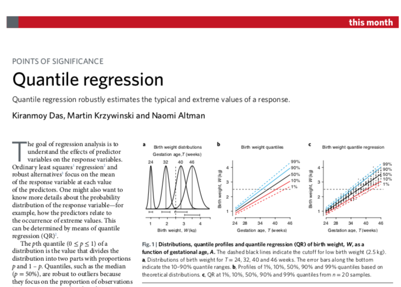
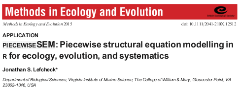
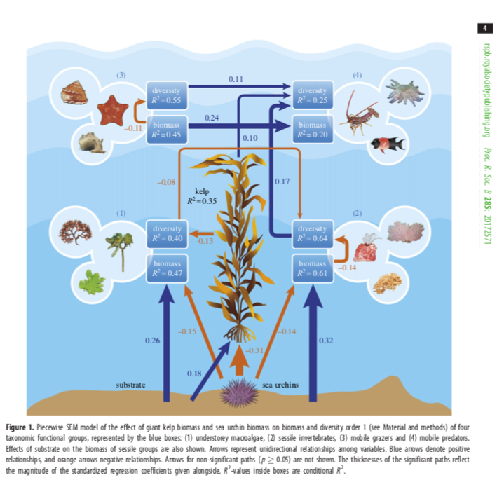

```{r setup, echo = F}
knitr::opts_chunk$set(
  comment = "#",
  collapse = TRUE,
  #cache = TRUE,
  warning = FALSE,
  message = FALSE,
  fig.width=6, fig.height=6,
  fig.align = 'center'
)
```

```{r, include = FALSE}
if (!require(knitr)) install.packages("knitr")
library(knitr)
```

# Quantile regressions

```{r, echo=FALSE, out.width=600}

```

&nbsp;

See intro on the subject [here](https://www.nature.com/articles/s41592-019-0406-y) and an example of application [here](https://www.biorxiv.org/content/10.1101/678375v1)

.alert[In R] : Package [quantreg](https://cran.r-project.org/web/packages/quantreg/index.html)

---

# Quantile regressions

.pull-left[

```{r, echo = FALSE}
library(ggplot2)
```

```{r quantreg, eval = FALSE}
data <- read.csv("data/lake_data.csv", 
                 header = T)

ggplot(aes(x= Fish_Length, 
           y=Trophic_Pos), 
           data = data) +
  geom_point() +
  # Add the response of each quantile
  geom_quantile(aes(
    colour = ..quantile..), 
    quantiles = seq(0.05, 0.95, 
                    by = 0.05)) +
  scale_colour_gradient2(low = "blue", 
                      mid = "black", 
                      high = "red", 
                      midpoint = 0.5) +
  # Add the predicted mean from lm
  geom_smooth(method = "lm", 
              linetype = "dashed", 
              col = "red", 
              size = 0.8, se = FALSE) 

```
]

.pull-right[

&nbsp;

```{r, echo = FALSE, ref.label="quantreg"}

```
]

---

# Structural equation modeling

&nbsp;

```{r, echo=FALSE, out.width=600}

```

&nbsp;

.alert[In R] : Package [piecewiseSEM](https://cran.r-project.org/web/packages/piecewiseSEM/index.html) and [lavaan](https://cran.r-project.org/web/packages/lavaan/index.html)

&nbsp;

[Here](https://besjournals.onlinelibrary.wiley.com/doi/abs/10.1111/2041-210X.12512) and [here](https://esajournals.onlinelibrary.wiley.com/doi/10.1890/ES12-00048.1) is where to start, [here](https://royalsocietypublishing.org/doi/pdf/10.1098/rspb.2017.2571) is an example of application on kelps associated biodiversity with a nice representation (see next slide), and [here](http://depts.washington.edu/wracuw/publications/pdfs/Yang2013PugetSdEelgrass.pdf) is another application on seagrass traits with a nice approach on how to test hypotheses using SEM and formulate a path diagram

---

# Structural equation modeling

```{r, echo=FALSE, out.width=600}

```

---

class: inverse, center, middle

# Machine learning 

---

# Boosted regression trees

The [ref](https://besjournals.onlinelibrary.wiley.com/doi/full/10.1111/j.1365-2656.2008.01390.x) for the method, an example of application on [coral reefs regimes](https://royalsocietypublishing.org/doi/10.1098/rspb.2018.2544) with a [tutorial](https://jbjouffray.github.io/ggBRT/ggBRT_Tutorial.html) and an example of application on [toxin levels prediction in lakes](https://onlinelibrary.wiley.com/doi/abs/10.1111/geb.12569).

.alert[In R] : Packages [dismo](https://cran.r-project.org/web/packages/dismo/index.html) and [ggBRT](https://github.com/JBjouffray/ggBRT)

&nbsp;

# Multivariate boosted regression trees
 
The [ref](https://arxiv.org/abs/1511.02025) for the method

.alert[In R] : Package [mvtboost](https://cran.r-project.org/web/packages/mvtboost/mvtboost.pdf)

&nbsp;

# Random forest

The [ref](https://link.springer.com/article/10.1023/A:1010933404324) for the method and an [example of application](https://www.nature.com/articles/s41558-018-0278-7)

.alert[In R] : Package [randomForest](https://cran.r-project.org/web/packages/randomForest/index.html)